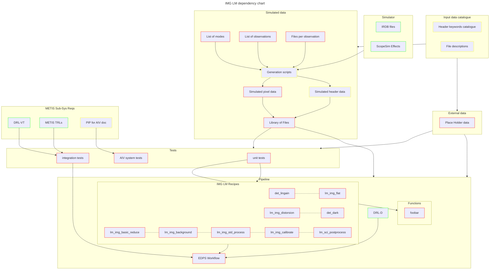

```mermaid

---
title: IMG LM dependency chart
---

flowchart TD

classDef open stroke:#f00
classDef inprog stroke:#ff0
classDef closed stroke:#0f0


subgraph data_catalogue[Input data catalogue]
        keywords[Header keywords catalogue]:::inprog
        file_descrip[File descriptions]:::inprog
    end

data_catalogue --> ext_data
data_catalogue --> sim_data


    subgraph simulator[Simulator]
        irdb[IRDB files]:::closed
        scopesim_effects[ScopeSim Effects]:::closed
    end

simulator --> files_gen_scripts


    subgraph sim_data[Simulated data]
        modes_list[List of modes]:::open
        obs_list[List of observations]:::open
        files_per_obs[Files per observation]:::open
        
        header_data[Simulated header data]:::inprog
        pixel_data[Simulated pixel data]:::open
        files_gen_scripts[Generation scripts]:::inprog
        files_library[Library of Files]:::open
        
        modes_list --> files_gen_scripts
        obs_list --> files_gen_scripts
        files_per_obs --> files_gen_scripts

        files_gen_scripts --> pixel_data
        files_gen_scripts --> header_data
        header_data --> files_library
        pixel_data --> files_library

    end


files_library --> tests
files_library --> pipeline


    subgraph ext_data[External data]
        ext_data_ph[Place Holder data]:::open
    end

ext_data --> tests
ext_data --> pipeline


    subgraph reqs[METIS Sub-Sys Reqs]
        drlvt[DRL-VT]:::closed
        polarion[METIS TRLs]:::closed
        pip_aiv[PIP for AIV doc]:::inprog
    end

polarion --> int_tests
drlvt --> int_tests
pip_aiv --> aiv_sys_tests


    subgraph tests[Tests]
        int_tests[integration tests]:::open       
        unit_tests[unit tests]:::open
        aiv_sys_tests[AIV system tests]:::open
    end

unit_tests --> functions
unit_tests --> recipes
int_tests --> edps


    subgraph pipeline[Pipeline]
        drld[DRL-D]:::closed
        edps[EDPS Workflow]:::open
        recipes[Recipes]
        functions[Functions]
        
    end

drld --> edps
recipes --> edps


    subgraph recipes[IMG LM Recipes]
        det_lingain:::open -.-
        lm_img_flat:::open
        
        lm_img_distorsion:::open -.-
        det_dark:::open
        
        lm_img_basic_reduce:::open -.-
        lm_img_background:::open -.-
        lm_img_std_process:::open -.-
        lm_img_calibrate:::open -.-
        lm_sci_postprocess:::open
    end


subgraph functions[Functions]
    foobar:::open
end

%% functions --> recipes


```

